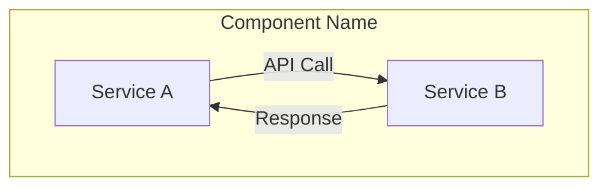
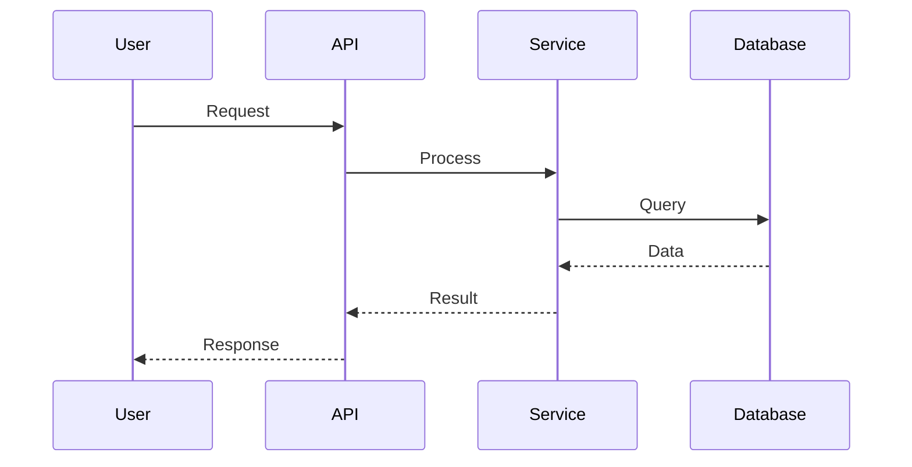
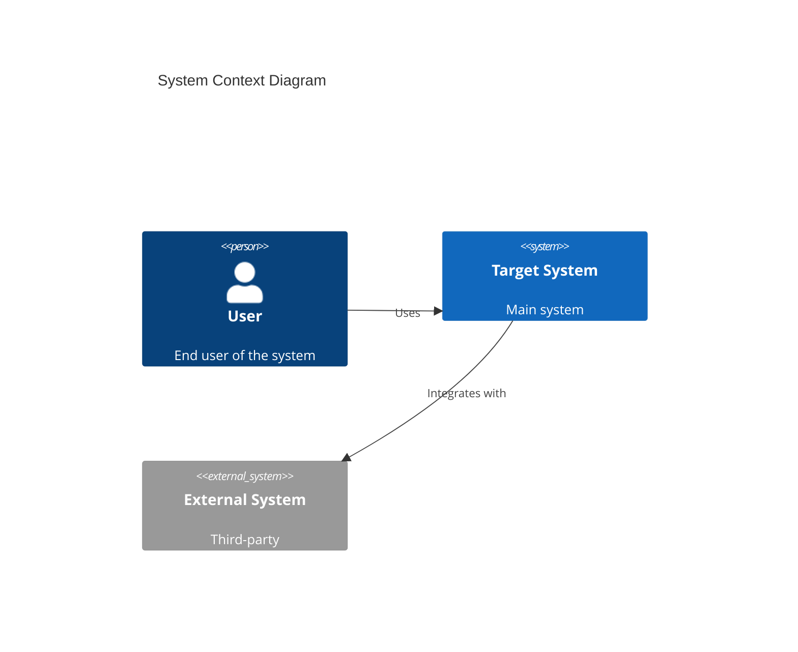
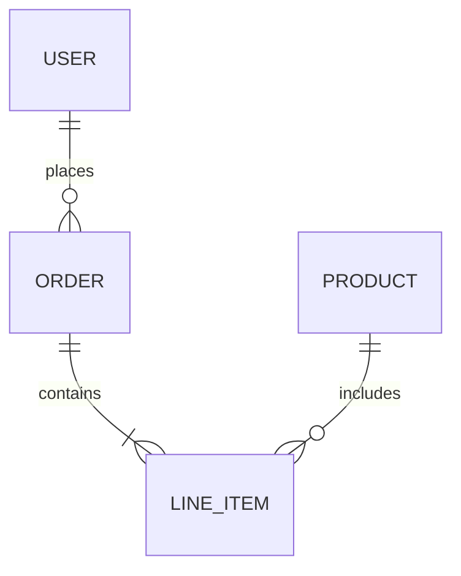

# Architecture Change Record (ACR) Skill

## Overview

This skill guides you through creating Architecture Change Records (ACRs) that document architectural decisions and changes to a codebase. It follows industry best practices using the MADR (Markdown Architecture Decision Record) format with enhanced risk analysis, visual diagrams, folder structure documentation, and automatic index management.

## When to Use This Skill

Use this skill when you need to:
- Document a significant architectural decision or change
- Propose modifications to system architecture
- Record technical decisions for future reference
- Evaluate trade-offs between architectural approaches
- Communicate architectural changes to stakeholders
- Create a historical record of system evolution

## Process

When invoked, this skill will:

### 1. Information Gathering

First, I'll ask you key questions to understand the architectural change:

- **Change Title**: What is this change about? (e.g., "Migrate from REST to GraphQL", "Introduce Event-Driven Architecture")
- **Context**: What is the current situation? What problem are we solving?
- **Scope**: Is this a localized change (single component) or system-wide?
- **Drivers**: What's driving this change? (performance, scalability, maintainability, compliance, cost)
- **Alternatives Considered**: What other approaches were evaluated?
- **Decision**: What solution was chosen and why?
- **Folder Structure Impact**: Does this change affect the project folder structure?

### 2. Architecture Diagrams

I'll create appropriate Mermaid diagrams based on the scope:

**For Component-Level Changes:**
- Component diagrams showing affected services
- Sequence diagrams for workflow changes
- Class diagrams for structural changes

**For System-Level Changes:**
- System context diagrams
- Container diagrams
- Deployment diagrams

**For Data-Related Changes:**
- Entity-relationship diagrams
- Data flow diagrams

**Both "Current" and "Proposed" architecture diagrams will be included.**

### 3. Folder Structure Documentation

For changes that affect the project structure, I'll document:
- **Current folder structure** (before the change)
- **Proposed folder structure** (after the change)
- **Highlighted changes** showing what's new, modified, or removed
- **Rationale** for structural changes

### 4. Risk Assessment

I'll help you assess risks using a 3-point scale (High/Medium/Low) for:

**Risks of MAKING the Change:**
- Implementation complexity
- System downtime/disruption
- Migration effort
- Testing scope
- Team learning curve
- Budget impact
- Timeline risk
- Integration challenges

**Risks of NOT Making the Change:**
- Technical debt accumulation
- Performance degradation
- Scalability limitations
- Maintenance burden
- Security vulnerabilities
- Competitive disadvantage
- Compliance issues

### 5. Document Generation

I'll create a properly formatted ACR using this structure:

```markdown
# ACR-NNNN: [Title]

**Status:** [Proposed | Accepted | Rejected | Superseded | Deprecated]
**Date:** YYYY-MM-DD
**Deciders:** [List of people involved in the decision]
**Technical Story:** [Optional: Link to ticket/issue]

---

## Context and Problem Statement

[Describe the context and problem statement]

## Decision Drivers

* [Driver 1]
* [Driver 2]
* [Driver 3]

---

## Current Architecture

### Overview
[Description of current architecture]

### Diagram
```mermaid
[Mermaid diagram of current architecture]
```

### Current Approach Characteristics
* [Characteristic 1]
* [Characteristic 2]

---

## Proposed Architecture

### Overview
[Description of proposed architecture]

### Diagram
```mermaid
[Mermaid diagram of proposed architecture]
```

### Proposed Approach Characteristics
* [Characteristic 1]
* [Characteristic 2]

---

## Project Structure Changes

### Current Structure (Before)

```
project-root/
├── src/
│   ├── components/
│   │   └── legacy/
│   └── utils/
├── tests/
└── config/
```

### Proposed Structure (After)

```
project-root/
├── src/
│   ├── components/
│   │   ├── legacy/          # [UNCHANGED]
│   │   └── new-feature/     # [NEW] New component architecture
│   ├── services/            # [NEW] Service layer
│   │   └── api/
│   └── utils/               # [MODIFIED] Restructured utilities
│       ├── common/          # [NEW]
│       └── helpers/         # [NEW]
├── tests/
│   ├── unit/                # [NEW] Organized test structure
│   └── integration/         # [NEW]
└── config/                  # [UNCHANGED]
```

### Structure Change Rationale

**Additions:**
- `src/services/`: New service layer to separate business logic from components
- `src/utils/common/` & `src/utils/helpers/`: Better organization of utility functions
- `tests/unit/` & `tests/integration/`: Clear separation of test types

**Modifications:**
- `src/utils/`: Restructured to improve maintainability and discoverability

**Removals:**
- None

**Impact:**
- Imports will need to be updated in approximately [N] files
- Build configuration may need updates
- Documentation references need updating

---

## Considered Alternatives

### Alternative 1: [Name]
**Description:** [Brief description]

**Pros:**
* [Pro 1]
* [Pro 2]

**Cons:**
* [Con 1]
* [Con 2]

**Folder Structure Impact:** [None | Minor | Moderate | Significant]

### Alternative 2: [Name]
[Same structure]

---

## Decision Outcome

**Chosen option:** [Selected approach]

**Justification:** [Why this option was chosen]

### Consequences

**Positive:**
* [Positive consequence 1]
* [Positive consequence 2]

**Negative:**
* [Negative consequence 1]
* [Negative consequence 2]

**Neutral:**
* [Neutral consequence 1]

---

## Risk Analysis

### Risks of Making This Change

| Risk Category | Risk Level | Description | Mitigation Strategy |
|--------------|------------|-------------|---------------------|
| Implementation | [High/Medium/Low] | [Description] | [Mitigation] |
| Downtime | [High/Medium/Low] | [Description] | [Mitigation] |
| Migration | [High/Medium/Low] | [Description] | [Mitigation] |
| Testing | [High/Medium/Low] | [Description] | [Mitigation] |
| Learning Curve | [High/Medium/Low] | [Description] | [Mitigation] |

**Overall Risk Rating: [High/Medium/Low]**

### Risks of NOT Making This Change

| Risk Category | Risk Level | Description | Impact Timeline |
|--------------|------------|-------------|-----------------|
| Technical Debt | [High/Medium/Low] | [Description] | [Short/Medium/Long term] |
| Performance | [High/Medium/Low] | [Description] | [Short/Medium/Long term] |
| Scalability | [High/Medium/Low] | [Description] | [Short/Medium/Long term] |
| Maintenance | [High/Medium/Low] | [Description] | [Short/Medium/Long term] |
| Security | [High/Medium/Low] | [Description] | [Short/Medium/Long term] |

**Overall Risk Rating: [High/Medium/Low]**

**Risk Comparison:**
[Summary comparing the risks of making vs not making the change]

---

## Implementation Notes

### Prerequisites
* [Prerequisite 1]
* [Prerequisite 2]

### Implementation Steps
1. [Step 1]
2. [Step 2]
3. [Step 3]

### Migration Path (for Folder Structure Changes)
1. Create new folder structure alongside existing
2. Gradually move files to new locations
3. Update imports and references
4. Update build configuration
5. Verify all tests pass
6. Remove old structure
7. Update documentation

### Rollback Strategy
[Description of how to rollback if needed]

### Success Criteria
* [Criterion 1]
* [Criterion 2]

---

## Links

* [Link to related ACRs]
* [Link to technical documentation]
* [Link to proof of concept]
* [Link to discussions/RFCs]

---

## Notes

[Additional notes, context, or clarifications]
```

### 6. File Management & Index Maintenance

I'll handle:
- **Automatic sequential numbering** (ACR-0001, ACR-0002, etc.)
- **Creation of `docs/architecture/records/` directory** if it doesn't exist
- **Proper filename format**: `NNNN-kebab-case-title.md`
- **Automatic index file maintenance** at `docs/architecture/records/README.md`

#### Index File Format

The index file (`docs/architecture/records/README.md`) will be automatically created/updated with:

```markdown
# Architecture Change Records (ACRs)

This directory contains all Architecture Change Records for [Project Name].

## Overview

Architecture Change Records (ACRs) document significant architectural decisions and changes to the codebase. Each record includes context, alternatives considered, decision rationale, risk analysis, and implementation guidance.

---

## Active Records

| ID | Title | Status | Date | Risk Level | Description |
|----|-------|--------|------|------------|-------------|
| [ACR-0003](0003-introduce-event-driven-architecture.md) | Introduce Event-Driven Architecture | Proposed | 2024-01-15 | High | Migration from synchronous to event-driven communication |
| [ACR-0002](0002-migrate-to-graphql.md) | Migrate from REST to GraphQL | Accepted | 2024-01-10 | Medium | API modernization to improve client flexibility |
| [ACR-0001](0001-introduce-api-gateway.md) | Introduce API Gateway Pattern | Implemented | 2024-01-05 | Medium | Centralize API routing and authentication |

---

## By Status

### 🟢 Implemented
- [ACR-0001: Introduce API Gateway Pattern](0001-introduce-api-gateway.md)

### 🟡 Accepted (Pending Implementation)
- [ACR-0002: Migrate from REST to GraphQL](0002-migrate-to-graphql.md)

### 🔵 Proposed (Under Review)
- [ACR-0003: Introduce Event-Driven Architecture](0003-introduce-event-driven-architecture.md)

### 🔴 Rejected
- None

### ⚫ Superseded
- None

### 🟤 Deprecated
- None

---

## By Risk Level

### High Risk Changes
- [ACR-0003: Introduce Event-Driven Architecture](0003-introduce-event-driven-architecture.md) - Proposed

### Medium Risk Changes
- [ACR-0002: Migrate from REST to GraphQL](0002-migrate-to-graphql.md) - Accepted
- [ACR-0001: Introduce API Gateway Pattern](0001-introduce-api-gateway.md) - Implemented

### Low Risk Changes
- None

---

## By Category

### Infrastructure
- [ACR-0001: Introduce API Gateway Pattern](0001-introduce-api-gateway.md)

### API Design
- [ACR-0002: Migrate from REST to GraphQL](0002-migrate-to-graphql.md)

### System Architecture
- [ACR-0003: Introduce Event-Driven Architecture](0003-introduce-event-driven-architecture.md)

---

## Statistics

- **Total ACRs:** 3
- **Implemented:** 1
- **Accepted:** 1
- **Proposed:** 1
- **Rejected:** 0
- **Superseded:** 0

---

## How to Create a New ACR

Use the Architecture Change Record skill:
```bash
# Invoke the ACR skill
/acr
```

Or follow the template in [TEMPLATE.md](TEMPLATE.md)

---

## Guidelines

1. **Create an ACR before making significant architectural changes**
2. **Get team review and approval** before marking as "Accepted"
3. **Update status** as changes progress through implementation
4. **Link related ACRs** to show architectural evolution
5. **Keep ACRs up-to-date** - update if understanding evolves
6. **Use clear, specific titles** that describe the change
7. **Document honestly** - include real constraints and trade-offs

---

## Template

See [TEMPLATE.md](TEMPLATE.md) for the ACR template structure.

---

**Last Updated:** 2024-01-15
```

---

## Best Practices

### Scope Guidance

**Small Changes** (Component-level):
- Single service modification
- Database schema change
- API endpoint redesign
- Library/framework upgrade
- Configuration change

*Diagram needs:* Simple component or sequence diagram
*Folder structure:* May not require structure changes

**Medium Changes** (Module-level):
- Multiple service interaction changes
- New microservice introduction
- Authentication/authorization changes
- Caching strategy implementation
- Message queue introduction

*Diagram needs:* Component + sequence diagrams
*Folder structure:* Likely requires new folders/reorganization

**Large Changes** (System-level):
- Complete architecture overhaul
- Cloud migration
- Microservices decomposition
- Multi-region deployment
- Technology stack change

*Diagram needs:* System context + container + deployment diagrams
*Folder structure:* Significant restructuring required

### Writing Guidelines

1. **Be Specific**: Avoid vague terms like "improve performance" - quantify with metrics
2. **Be Honest**: Document real constraints and trade-offs
3. **Be Forward-Looking**: Consider maintenance and evolution
4. **Be Visual**: Use diagrams liberally - they communicate faster than text
5. **Be Practical**: Include implementation guidance, not just theory
6. **Show Structure Changes**: Always include before/after folder structure when relevant
7. **Highlight Changes**: Use annotations like [NEW], [MODIFIED], [REMOVED] in folder trees

### Risk Rating Guidelines

**High Risk:**
- Multiple unknowns
- Significant system-wide impact
- Requires extensive testing
- Long implementation timeline
- High probability of issues
- Difficult rollback

**Medium Risk:**
- Some unknowns
- Moderate impact
- Standard testing required
- Reasonable timeline
- Manageable issues
- Straightforward rollback

**Low Risk:**
- Well understood
- Limited impact
- Minimal testing needed
- Quick implementation
- Low probability of issues
- Easy rollback

### Folder Structure Documentation Guidelines

**Always Include When:**
- New directories are added
- Existing directories are reorganized
- Files are moved between locations
- Module structure changes
- Package organization changes

**Use Annotations:**
- `# [NEW]` - New file or directory
- `# [MODIFIED]` - Existing but changed
- `# [REMOVED]` - Will be deleted
- `# [MOVED FROM: old/path]` - Relocated
- `# [UNCHANGED]` - Explicitly mark unchanged important directories

**Show Impact:**
- Estimate number of files affected
- List import paths that need updating
- Note build configuration changes
- Document test changes needed

---

## Examples

### Example 1: Small Change with No Structure Impact
**Title:** "Replace Synchronous Email Service with Message Queue"
- **Scope:** Single email service component
- **Diagrams:** Before/after component diagram, sequence diagram
- **Folder Structure:** No changes required
- **Risk:** Medium (new infrastructure, but isolated)

### Example 2: Medium Change with Structure Impact
**Title:** "Introduce API Gateway Pattern"
- **Scope:** All external-facing services
- **Diagrams:** System context, component diagram, deployment change
- **Folder Structure:** New `gateway/` directory, restructured `routes/`
- **Risk:** High (affects all API consumers, requires migration)

### Example 3: Large Change with Major Restructuring
**Title:** "Migrate from Monolith to Microservices Architecture"
- **Scope:** Entire application architecture
- **Diagrams:** Current monolith, target microservices, deployment, data flow
- **Folder Structure:** Complete restructuring - from single `src/` to multiple service directories
- **Risk:** High (massive undertaking, multi-phase)

---

## Mermaid Diagram Templates

### Component Diagram Template


### Sequence Diagram Template


### System Context Template


### Entity Relationship Template


---

## Output Location

All ACRs will be saved to:
```
docs/architecture/records/NNNN-title-slug.md
```

The index file will be maintained at:
```
docs/architecture/records/README.md
```

Optional template file can be created at:
```
docs/architecture/records/TEMPLATE.md
```

---

## Quality Checklist

Before finalizing an ACR, verify:

- [ ] Title is clear and descriptive
- [ ] Status is set appropriately
- [ ] Context explains the "why"
- [ ] Current architecture is documented
- [ ] Proposed architecture is documented
- [ ] Both architectures have diagrams
- [ ] Diagrams are correct and render properly
- [ ] Folder structure changes are documented (if applicable)
- [ ] Before/after folder trees are accurate
- [ ] Structure annotations are clear ([NEW], [MODIFIED], etc.)
- [ ] At least 2 alternatives are documented
- [ ] Decision rationale is clear
- [ ] Consequences are realistic
- [ ] Risk analysis is complete for BOTH scenarios
- [ ] Risk levels are justified
- [ ] Mitigation strategies are practical
- [ ] Implementation notes are actionable
- [ ] Links are valid and relevant
- [ ] Document is well-formatted
- [ ] Sequential number is correct
- [ ] Index file is updated with new ACR

---

## Interactive Mode

When you invoke this skill, I will:

1. **Ask clarifying questions** to understand your architectural change
2. **Explore your codebase** (if needed) to understand current architecture and folder structure
3. **Generate folder tree representations** for before/after views
4. **Draft the ACR document** with appropriate diagrams and structure documentation
5. **Present the draft** for your review
6. **Iterate based on feedback** until you're satisfied
7. **Save the final ACR** with proper numbering and location
8. **Update the index file** automatically with the new ACR entry
9. **Generate or update TEMPLATE.md** if needed

---

## Index Maintenance

The index file (`README.md`) will be automatically updated with:

1. **New ACR entry** in the main table with link, status, date, risk level
2. **Status section update** to categorize the ACR
3. **Risk level section update** to group by risk
4. **Category section update** (if categories are defined)
5. **Statistics update** with new counts
6. **Last updated date** timestamp

**Index will group ACRs by:**
- Status (Proposed, Accepted, Implemented, Rejected, Superseded, Deprecated)
- Risk Level (High, Medium, Low)
- Category (Infrastructure, API, Data, Security, etc.)
- Date (chronologically in main table)

---

## Notes

- ACRs are **living documents** - they can be updated as understanding evolves
- Use **Status** field to track lifecycle: Proposed → Accepted → Implemented/Rejected
- Consider creating **lightweight ACRs** for smaller changes - not every change needs a 10-page document
- **Link related ACRs** to show evolution of architecture over time
- **Review ACRs periodically** to ensure they reflect reality
- **Supersede old ACRs** rather than deleting them - history is valuable
- **Update index automatically** - the skill handles this for you
- **Folder structure changes are critical** - always document them when they occur
- **Use structure annotations** to make changes immediately visible

---

## Advanced Features

### Version Control Integration
- ACRs are markdown files - perfect for PR reviews
- Architectural changes can be discussed via PR comments
- Historical changes are tracked in git history
- Index changes show ACR additions/modifications

### Team Collaboration
- Use PR process to get team buy-in on architectural decisions
- Tag relevant stakeholders for review
- Document consensus in the "Deciders" field
- Review index to see all pending and implemented decisions

### Compliance & Audit
- ACRs provide audit trail for architectural decisions
- Demonstrate due diligence in decision-making
- Show risk analysis and mitigation planning
- Index provides quick overview for auditors

### Searchability
- Index provides multiple views: by status, risk, category
- Statistics give project health insights
- Links make navigation easy
- Folder structure documentation helps newcomers understand project organization

---

## Quick Start

Simply invoke this skill and I'll guide you through creating your ACR! You can say:

- "Create an ACR for [your change]"
- "I need to document an architectural decision about [topic]"
- "Help me create an architecture change record"
- "/acr" (if configured as a shortcut)

I'll take care of the rest, including:
- ✅ Generating the ACR document
- ✅ Creating appropriate diagrams
- ✅ Documenting folder structure changes
- ✅ Performing risk analysis
- ✅ Numbering sequentially
- ✅ Updating the index file

**Let's document your architecture changes professionally!**
