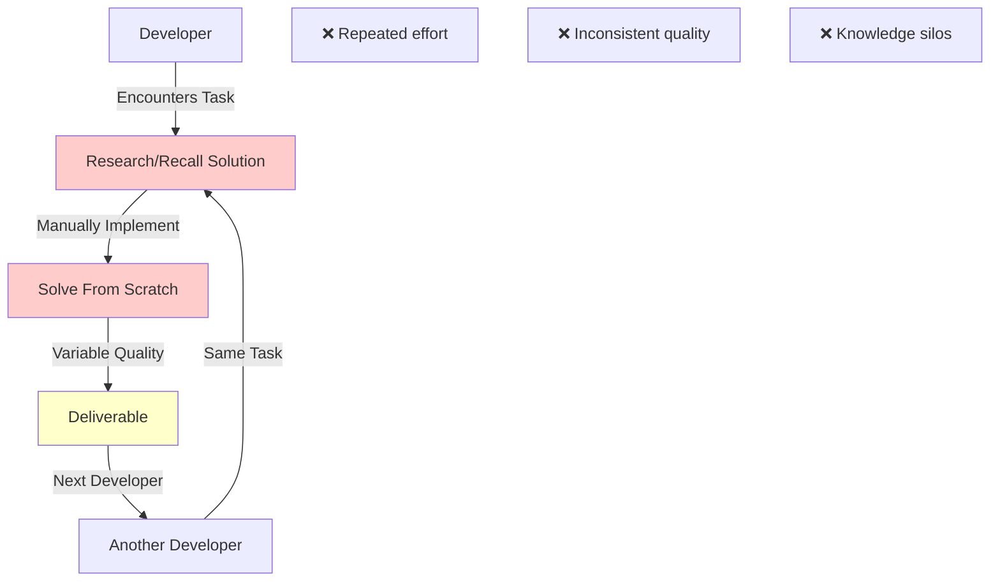
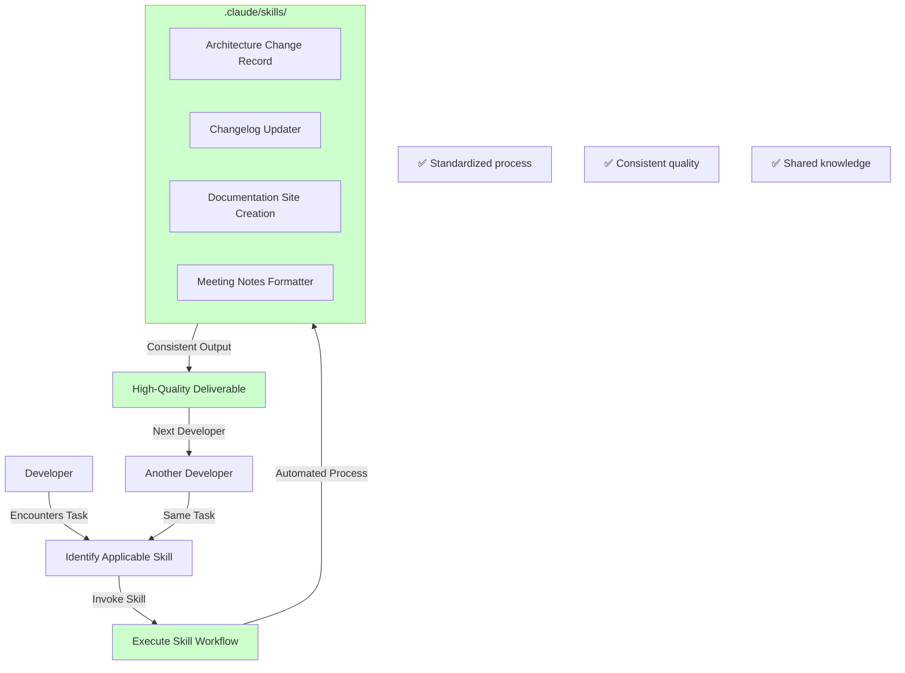

# ACR-0001: Introduce Structured Skills Library in Development Workflow

**Status:** Accepted
**Date:** 2026-01-04
**Deciders:** Development Team, garrardkitchen
**Technical Story:** Initial skills framework implementation

---

## Context and Problem Statement

Development teams frequently encounter repetitive tasks such as creating architecture documentation, maintaining changelogs, formatting meeting notes, and building documentation sites. Currently, these tasks are handled ad-hoc, leading to:

- **Inconsistent quality** across deliverables
- **Wasted time** solving the same problems repeatedly
- **Knowledge silos** where only certain developers know best practices
- **Lack of standardization** in documentation and architectural decisions
- **Onboarding friction** for new team members

We need a systematic approach to capture, standardize, and reuse development patterns and workflows.

## Decision Drivers

* **Efficiency**: Reduce time spent on repetitive development tasks
* **Consistency**: Ensure standardized output across all developers
* **Knowledge Sharing**: Capture institutional knowledge in reusable components
* **Onboarding**: Accelerate new developer productivity
* **Quality**: Enforce industry best practices automatically
* **Maintainability**: Centralize workflow improvements in one location
* **Scalability**: Enable easy addition of new skills over time

---

## Current Architecture

### Overview

The current development workflow relies on individual developer knowledge and ad-hoc approaches:

- Developers manually create architecture documents (if at all)
- Changelogs are inconsistently maintained or forgotten
- Meeting notes lack standardized structure
- Documentation sites are built from scratch each time
- No centralized repository of development patterns
- Knowledge transfer happens through code review or verbal communication

### Diagram



### Current Approach Characteristics

* **Ad-hoc**: No standardized processes or templates
* **Developer-dependent**: Quality varies by individual experience
* **Time-consuming**: Repeated research and implementation
* **Undocumented**: Best practices exist in developer minds only
* **Fragmented**: No central repository of solutions
* **Error-prone**: Manual processes lead to mistakes and omissions

---

## Proposed Architecture

### Overview

Introduce a structured skills library using Claude Code's skills framework:

- **Centralized skills repository** at `.claude/skills/`
- **Reusable, documented workflows** for common development tasks
- **Standardized templates** following industry best practices
- **Automatic execution** through Claude Code integration
- **Version-controlled** skills with changelog tracking
- **Extensible framework** for adding new skills

Initial skills include:
1. **Architecture Change Records (ACR)** - MADR-format architecture documentation
2. **Changelog Updater** - Keep a Changelog compliant maintenance
3. **Documentation Site Creation** - Hugo-based documentation generation
4. **Meeting Notes Formatter** - Structured meeting summary generation

### Diagram



### Proposed Approach Characteristics

* **Standardized**: Consistent processes across all developers
* **Documented**: Each skill includes comprehensive instructions
* **Automated**: Reduces manual work through guided workflows
* **Maintainable**: Central location for updates and improvements
* **Scalable**: Easy to add new skills as needs arise
* **Quality-enforced**: Built-in best practices and validation
* **Collaborative**: Skills improve through team contributions

---

## Project Structure Changes

### Current Structure (Before)

```
project-root/
├── src/                           # Source code
├── tests/                         # Tests
├── docs/                          # Ad-hoc documentation (if any)
├── README.md                      # Basic project info
└── .gitignore
```

### Proposed Structure (After)

```
project-root/
├── src/                           # [UNCHANGED] Source code
├── tests/                         # [UNCHANGED] Tests
├── docs/                          # [MODIFIED] Enhanced documentation structure
│   └── architecture/              # [NEW] Architecture documentation
│       └── records/               # [NEW] Architecture Change Records
│           ├── README.md          # [NEW] ACR index with categorization
│           ├── TEMPLATE.md        # [NEW] ACR template
│           └── 0001-*.md          # [NEW] Individual ACRs
├── .claude/                       # [NEW] Claude Code configuration
│   └── skills/                    # [NEW] Skills library
│       ├── CHANGELOG.md           # [NEW] Skills changelog
│       ├── architecture-change-record/  # [NEW] ACR skill
│       │   └── SKILL.md
│       ├── changelog-updater/     # [NEW] Changelog skill
│       │   └── SKILL.md
│       ├── documentation-site-creation/  # [NEW] Docs skill
│       │   └── SKILL.md
│       └── meeting-notes/         # [NEW] Meeting notes skill
│           └── SKILL.md
├── CHANGELOG.md                   # [NEW] Project changelog
├── README.md                      # [UNCHANGED] Basic project info
└── .gitignore                     # [MODIFIED] Exclude .claude/settings.local.json
```

### Structure Change Rationale

**Additions:**
- `.claude/skills/`: Central repository for all development skills, organized by function
- `docs/architecture/records/`: Formal location for architecture decisions following ADR pattern
- `CHANGELOG.md`: Project-level changelog following Keep a Changelog standard
- `.claude/skills/CHANGELOG.md`: Skills-specific changelog to track skill evolution

**Modifications:**
- `docs/`: Enhanced from basic documentation to structured documentation with architecture subsection
- `.gitignore`: Updated to exclude local Claude settings while preserving shared skills

**Removals:**
- None

**Impact:**
- New developers can immediately access standardized workflows
- Architecture decisions are formally documented and discoverable
- Changelog maintenance becomes automated and consistent
- Documentation generation becomes streamlined
- Approximately 4 new directories, 10+ new files in skills library
- No impact on existing source code or build processes
- CI/CD pipelines unaffected (unless skills are explicitly integrated)

---

## Considered Alternatives

### Alternative 1: External Documentation Wiki

**Description:** Maintain development best practices in an external wiki (Confluence, Notion, etc.)

**Pros:**
* Rich formatting and collaboration features
* Accessible from anywhere via browser
* Built-in versioning and comments
* No code repository changes needed

**Cons:**
* **Disconnected from code**: Not version-controlled with project
* **Manual execution**: Developers must read and manually implement
* **Stale quickly**: External docs tend to fall out of sync
* **No automation**: Cannot execute workflows automatically
* **Access barriers**: Requires separate login and permissions
* **Search fragmentation**: Knowledge split across multiple systems

**Folder Structure Impact:** None

### Alternative 2: Shell Scripts Repository

**Description:** Create a repository of bash/python scripts for common tasks

**Pros:**
* Executable automation
* Version controlled
* Shareable across team
* No special tools required

**Cons:**
* **Limited guidance**: Scripts don't explain "why" or context
* **No interactive workflows**: Can't adapt to different scenarios
* **Maintenance burden**: Each script needs individual documentation
* **Language-specific**: Bash might not work on all platforms
* **No AI assistance**: Cannot leverage LLM capabilities for complex tasks
* **Quality varies**: Hard to enforce consistent standards

**Folder Structure Impact:** Minimal (single `scripts/` directory)

### Alternative 3: IDE Snippets/Templates

**Description:** Use IDE code snippets and file templates for standardization

**Pros:**
* Fast insertion of boilerplate
* IDE-integrated (no context switching)
* Developer-specific customization
* Works offline

**Cons:**
* **Static only**: Cannot handle dynamic/conditional logic
* **IDE-locked**: Different IDEs require different formats
* **Limited scope**: Only works for code, not documentation/process
* **No reasoning**: Cannot analyze project context
* **Synchronization issues**: Hard to keep snippets updated across team
* **No workflow guidance**: Just templates, no process automation

**Folder Structure Impact:** None (IDE-specific configuration)

---

## Decision Outcome

**Chosen option:** Introduce Structured Skills Library using Claude Code framework

**Justification:**

1. **Intelligent Automation**: Claude Code skills combine documentation with execution, providing context-aware assistance
2. **Version Control Integration**: Skills are versioned alongside code, ensuring synchronization
3. **AI-Powered Flexibility**: Skills can adapt to project-specific contexts while maintaining standards
4. **Extensibility**: Easy to add new skills as team needs evolve
5. **Low Friction**: Minimal project structure changes, high developer value
6. **Future-Proof**: Builds on emerging AI-assisted development patterns
7. **Gradual Adoption**: Can introduce skills incrementally without disrupting existing workflows

### Consequences

**Positive:**
* ✅ **Reduced repetitive work** - Common tasks automated with consistent quality
* ✅ **Faster onboarding** - New developers gain immediate access to team patterns
* ✅ **Improved documentation** - Architecture decisions and changelogs maintained automatically
* ✅ **Knowledge preservation** - Institutional knowledge captured in executable form
* ✅ **Quality consistency** - Industry best practices enforced through skill design
* ✅ **Scalable learning** - New skills can be added as team discovers new patterns
* ✅ **Reduced technical debt** - Better documentation and architectural decision tracking

**Negative:**
* ⚠️ **Learning curve** - Team needs to learn skill invocation and customization
* ⚠️ **Dependency on Claude Code** - Requires Claude Code CLI to be installed
* ⚠️ **Maintenance responsibility** - Skills need periodic updates and improvements
* ⚠️ **Initial time investment** - Creating skills requires upfront effort
* ⚠️ **Version compatibility** - Skills may need updates as Claude Code evolves

**Neutral:**
* ℹ️ **New directory structure** - Adds `.claude/skills/` to repository
* ℹ️ **Additional documentation** - More files to maintain, but automated generation reduces burden
* ℹ️ **Skill governance needed** - Team should define process for adding/modifying skills

---

## Risk Analysis

### Risks of Making This Change

| Risk Category | Risk Level | Description | Mitigation Strategy |
|--------------|------------|-------------|---------------------|
| Implementation | **Low** | Adding skills is non-invasive; doesn't affect existing code or build processes | Start with 4 proven skills; add incrementally |
| Adoption | **Medium** | Developers might not use skills if unclear or inconvenient | Provide clear documentation; demonstrate value with quick wins |
| Maintenance | **Low** | Skills need updates as best practices evolve | Assign ownership; include skills in code review process |
| Tool Dependency | **Medium** | Reliance on Claude Code CLI availability and stability | Skills are markdown-based; can be used as reference even without CLI |
| Learning Curve | **Low** | Team needs to learn skill invocation syntax | Simple skill interface; comprehensive examples in each skill |
| Quality Control | **Low** | Poorly designed skills could enforce bad practices | Peer review skill PRs; validate against industry standards |

**Overall Risk Rating: Low**

### Risks of NOT Making This Change

| Risk Category | Risk Level | Description | Impact Timeline |
|--------------|------------|-------------|-----------------|
| Productivity Loss | **High** | Continued time waste on repetitive tasks; developers reinvent solutions | Immediate & Ongoing |
| Quality Inconsistency | **High** | Deliverables vary by developer experience; missing documentation | Immediate & Ongoing |
| Knowledge Silos | **High** | Best practices trapped in individual minds; high bus factor | Medium-term |
| Onboarding Friction | **Medium** | New developers struggle without standardized patterns | Medium-term |
| Technical Debt | **High** | Poor documentation of architecture decisions leads to confusion and rework | Long-term |
| Competitive Disadvantage | **Medium** | Teams with better automation deliver faster and with higher quality | Long-term |
| Scale Issues | **High** | Manual processes become bottlenecks as team/codebase grows | Medium to Long-term |

**Overall Risk Rating: High**

**Risk Comparison:**

The risks of **NOT** making this change significantly outweigh the risks of implementation. Current ad-hoc practices create ongoing productivity loss, quality issues, and knowledge management problems that compound over time. The proposed skills library introduces minimal risk (primarily around adoption and maintenance) while providing immediate value through automation and standardization.

Key insight: The **status quo is high risk** because it scales poorly and creates increasing technical and knowledge debt. The skills library is a **low-risk, high-reward** investment that pays dividends as the team and codebase grow.

---

## Implementation Notes

### Prerequisites

* Claude Code CLI installed on developer machines
* Git repository for skills (can be separate or in-project)
* Team agreement on skill adoption and maintenance process
* Initial 4 skills ready for deployment:
  - Architecture Change Record (ACR)
  - Changelog Updater
  - Documentation Site Creation
  - Meeting Notes Formatter

### Implementation Steps

1. **Create Skills Repository Structure**
   ```bash
   mkdir -p .claude/skills
   mkdir -p docs/architecture/records
   ```

2. **Add Initial Skills**
   - Copy skill definitions to `.claude/skills/`
   - Ensure each skill has comprehensive SKILL.md documentation
   - Test skills individually before broader rollout

3. **Update Project Configuration**
   - Add `.claude/settings.local.json` to `.gitignore`
   - Create `CHANGELOG.md` in project root
   - Create ACR index at `docs/architecture/records/README.md`

4. **Team Onboarding**
   - Conduct skills walkthrough session
   - Demonstrate each skill with real examples
   - Document invocation patterns in team wiki/README
   - Identify early adopters as champions

5. **Create First ACR**
   - Use ACR skill to document this very decision (meta!)
   - Demonstrates value immediately
   - Provides template for future ACRs

6. **Establish Governance**
   - Define process for proposing new skills
   - Assign skill maintainers/reviewers
   - Schedule quarterly skill review/cleanup
   - Create contribution guidelines

### Migration Path (for Folder Structure Changes)

1. Create `.claude/skills/` directory structure
2. Add initial 4 skills with documentation
3. Create `docs/architecture/records/` for ACRs
4. Add `CHANGELOG.md` and index files
5. Update `.gitignore` with Claude Code exclusions
6. Verify git status shows expected new files
7. Commit skills with comprehensive initial commit message
8. Update project README with skills documentation link

### Rollback Strategy

**Low risk, simple rollback:**

1. Remove `.claude/skills/` directory
2. Remove `docs/architecture/records/` directory
3. Remove `CHANGELOG.md` from root
4. Revert `.gitignore` changes
5. Existing code and processes remain unaffected

**Note:** Skills can also be kept but simply not used, making this a very low-friction decision with easy reversibility.

### Success Criteria

* ✅ All 4 initial skills documented and tested
* ✅ At least 3 team members have successfully invoked skills
* ✅ First ACR created using the ACR skill
* ✅ CHANGELOG.md maintained for at least 2 release cycles
* ✅ Team reports time savings on at least 2 common tasks
* ✅ New developer onboarded using skills within first week
* ✅ Positive team feedback on skill utility and usability
* ✅ No skill-related blocking issues reported

---

## Links

* [Keep a Changelog](https://keepachangelog.com/) - Changelog best practices
* [MADR](https://adr.github.io/madr/) - Markdown Architecture Decision Records
* [Claude Code Documentation](https://docs.anthropic.com/claude/docs) - Official Claude Code docs
* [Hugo Documentation](https://gohugo.io/documentation/) - For documentation site creation skill
* [Semantic Versioning](https://semver.org/) - Versioning standard used by changelog skill

---

## Notes

### Why These 4 Initial Skills?

The initial skill set was chosen based on:

1. **High frequency**: These tasks occur regularly across projects
2. **Standardization benefit**: Significant value from consistent execution
3. **Time-intensive**: Manual execution is slow and error-prone
4. **Best practices exist**: Clear industry standards to follow
5. **Broad applicability**: Useful across different project types

### Future Skill Candidates

Potential skills to add based on team needs:

- **Code Review Checklist Generator** - Custom checklists by language/framework
- **API Documentation Generator** - OpenAPI/Swagger spec creation
- **Security Audit Checklist** - OWASP-based security review workflows
- **Performance Profiling Guide** - Systematic performance analysis
- **Database Migration Script Generator** - Safe schema evolution
- **Incident Post-Mortem Template** - Structured incident analysis
- **Sprint Planning Helper** - Story estimation and capacity planning

### Skill Development Guidelines

When creating new skills:

1. **Start with common pain points** - Address frequent, time-consuming tasks
2. **Follow existing patterns** - Use SKILL.md format, include examples
3. **Document thoroughly** - Explain when/why to use the skill
4. **Test extensively** - Verify skill works in different project contexts
5. **Get peer review** - Ensure skill follows team standards
6. **Iterate based on feedback** - Improve skills based on actual usage

### Measuring Success

Track these metrics over 3 months:

- **Adoption rate**: % of team using skills regularly
- **Time savings**: Estimated hours saved per task
- **Quality improvements**: Reduction in documentation errors/omissions
- **Onboarding speed**: Time for new developer to become productive
- **Team satisfaction**: Survey feedback on skill utility

---

**Document Status:** ✅ Accepted and Implemented
**Next Review Date:** 2026-04-04 (3 months)
**Assigned Owner:** garrardkitchen
