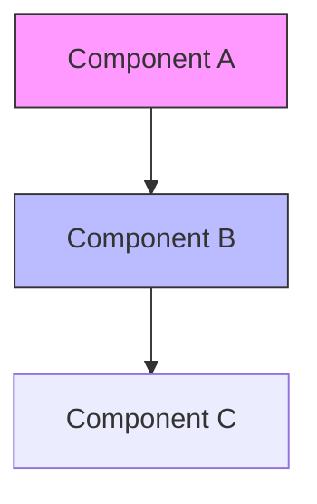
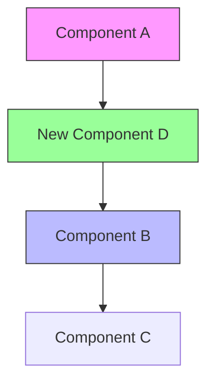
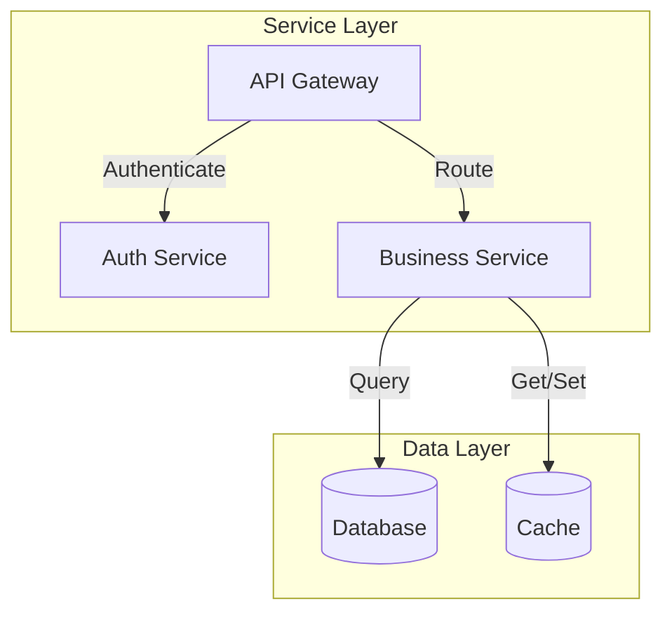
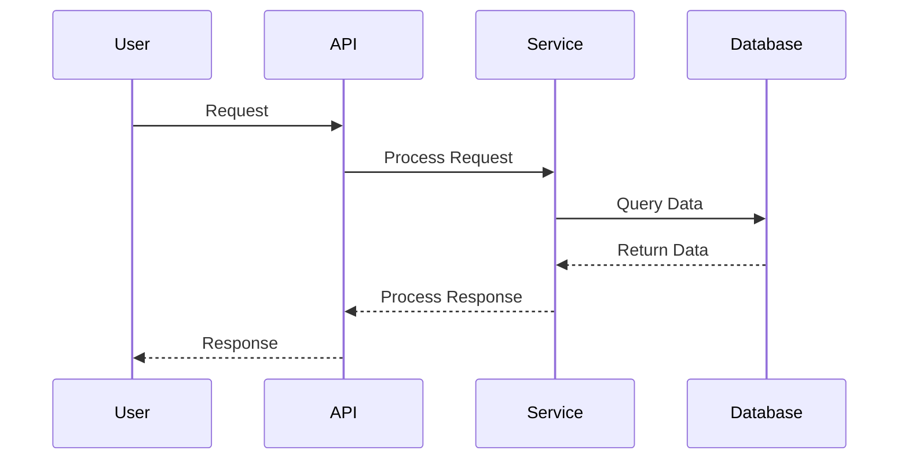
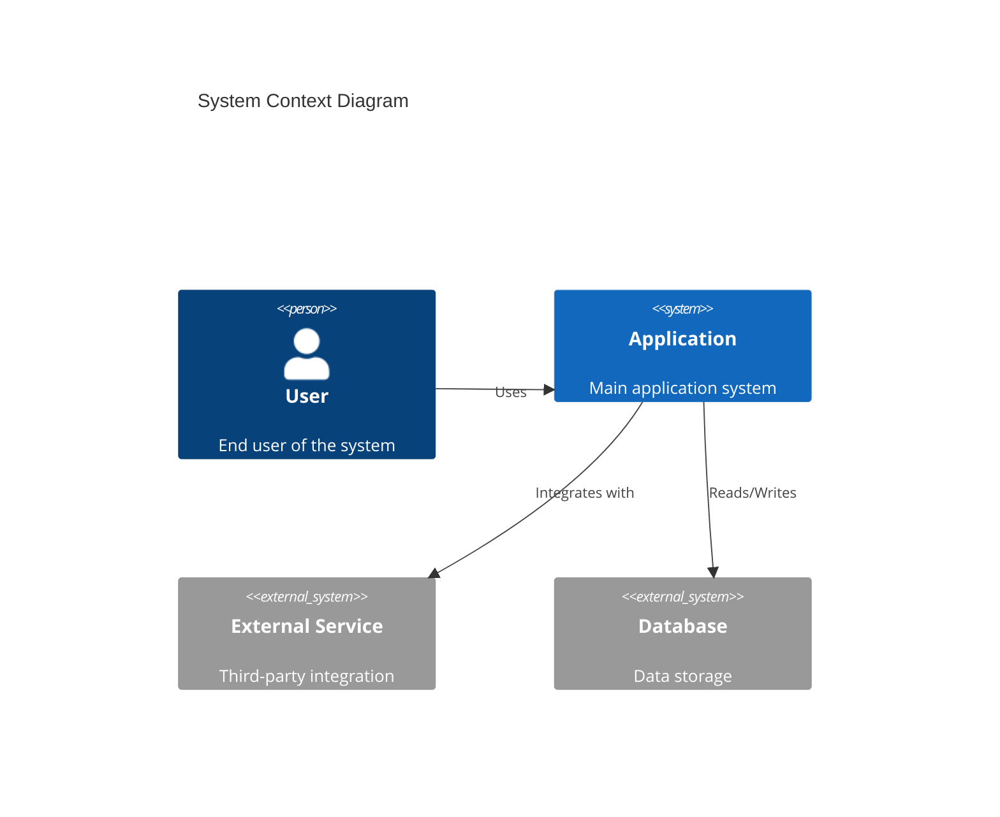
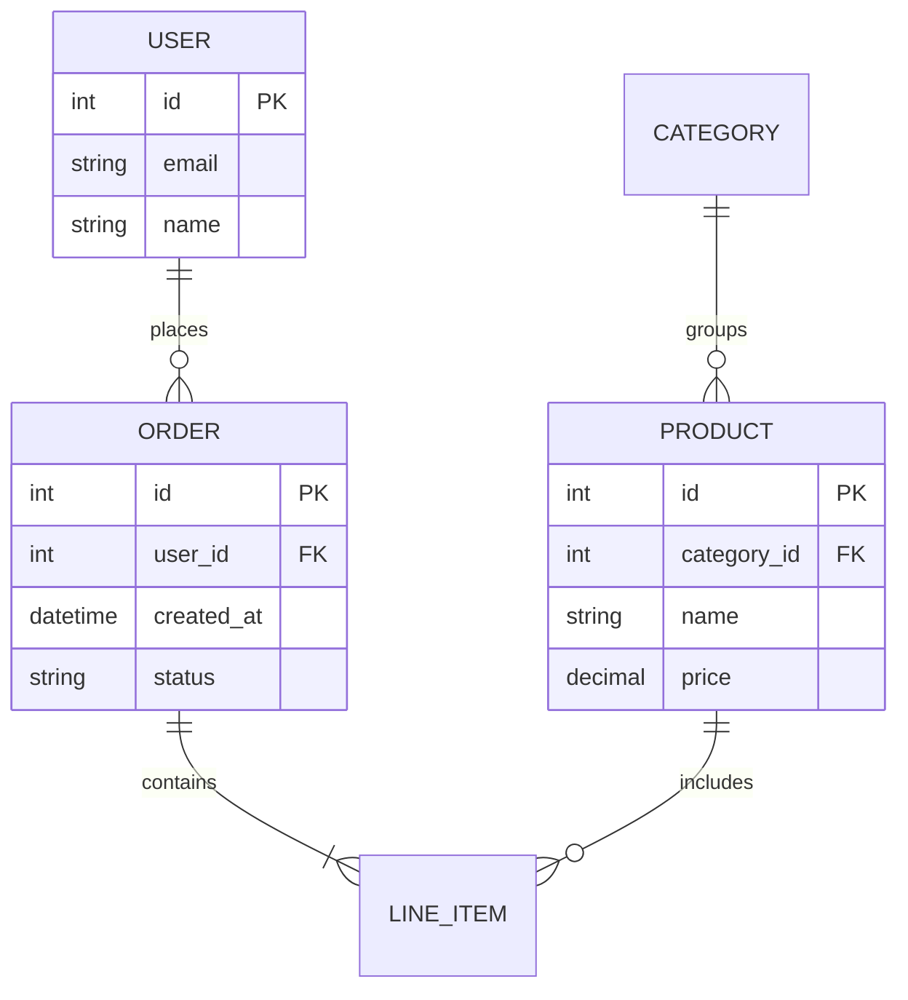

# ACR-NNNN: [Descriptive Title]

**Status:** [Proposed | Accepted | Rejected | Superseded | Deprecated]
**Date:** YYYY-MM-DD
**Deciders:** [Names of people involved in the decision]
**Technical Story:** [Optional: Link to issue/ticket]

---

## Context and Problem Statement

[Describe the context and problem statement, e.g., in free form using two to three sentences. You may want to articulate the problem in the form of a question.]

## Decision Drivers

* [Driver 1, e.g., a force, facing concern, ...]
* [Driver 2, e.g., a force, facing concern, ...]
* [Driver 3, e.g., a force, facing concern, ...]
* ...

---

## Current Architecture

### Overview

[Describe the current architecture, system, or approach. Explain what exists today and why it's being considered for change.]

### Diagram



### Current Approach Characteristics

* [Characteristic 1]
* [Characteristic 2]
* [Characteristic 3]

---

## Proposed Architecture

### Overview

[Describe the proposed new architecture, system, or approach. Explain what will change and how it will work.]

### Diagram



### Proposed Approach Characteristics

* [Characteristic 1]
* [Characteristic 2]
* [Characteristic 3]

---

## Project Structure Changes

### Current Structure (Before)

```
project-root/
├── src/
│   ├── module-a/
│   └── module-b/
├── tests/
└── config/
```

### Proposed Structure (After)

```
project-root/
├── src/
│   ├── module-a/              # [UNCHANGED]
│   ├── module-b/              # [MODIFIED] Restructured for new pattern
│   │   ├── core/              # [NEW]
│   │   └── utils/             # [NEW]
│   └── module-c/              # [NEW] New module
├── tests/
│   ├── unit/                  # [NEW] Organized test structure
│   └── integration/           # [NEW]
└── config/                    # [UNCHANGED]
```

### Structure Change Rationale

**Additions:**
- [Describe new directories/files and why they're needed]

**Modifications:**
- [Describe changed directories/files and what's different]

**Removals:**
- [Describe deleted directories/files and why they're no longer needed]

**Impact:**
- [Describe how many files are affected, import changes needed, build config updates, etc.]

---

## Considered Alternatives

### Alternative 1: [Name/Description]

**Description:** [Brief description of this alternative approach]

**Pros:**
* [Pro 1]
* [Pro 2]
* [Pro 3]

**Cons:**
* [Con 1]
* [Con 2]
* [Con 3]

**Folder Structure Impact:** [None | Minor | Moderate | Significant]

### Alternative 2: [Name/Description]

**Description:** [Brief description of this alternative approach]

**Pros:**
* [Pro 1]
* [Pro 2]

**Cons:**
* [Con 1]
* [Con 2]

**Folder Structure Impact:** [None | Minor | Moderate | Significant]

### Alternative 3: [Name/Description]

[Same structure as above]

---

## Decision Outcome

**Chosen option:** [Name/description of chosen option]

**Justification:** [Explain why this option was chosen over the alternatives. Reference specific decision drivers.]

### Consequences

**Positive:**
* [Positive consequence 1]
* [Positive consequence 2]
* [Positive consequence 3]

**Negative:**
* [Negative consequence 1]
* [Negative consequence 2]
* [Negative consequence 3]

**Neutral:**
* [Neutral consequence 1]
* [Neutral consequence 2]

---

## Risk Analysis

### Risks of Making This Change

| Risk Category | Risk Level | Description | Mitigation Strategy |
|--------------|------------|-------------|---------------------|
| Implementation | [High/Medium/Low] | [What could go wrong during implementation] | [How to reduce this risk] |
| Downtime | [High/Medium/Low] | [Potential for system unavailability] | [How to minimize downtime] |
| Migration | [High/Medium/Low] | [Complexity of migrating existing data/code] | [Migration approach] |
| Testing | [High/Medium/Low] | [Scope and complexity of testing needed] | [Testing strategy] |
| Learning Curve | [High/Medium/Low] | [Team's familiarity with new approach] | [Training/documentation plan] |
| Budget | [High/Medium/Low] | [Financial implications] | [Cost control measures] |
| Timeline | [High/Medium/Low] | [Risk of delays or overruns] | [Schedule management approach] |

**Overall Risk Rating: [High/Medium/Low]**

### Risks of NOT Making This Change

| Risk Category | Risk Level | Description | Impact Timeline |
|--------------|------------|-------------|-----------------|
| Technical Debt | [High/Medium/Low] | [Accumulation of suboptimal code/patterns] | [Short/Medium/Long term] |
| Performance | [High/Medium/Low] | [Performance degradation over time] | [Short/Medium/Long term] |
| Scalability | [High/Medium/Low] | [Inability to scale as needs grow] | [Short/Medium/Long term] |
| Maintenance | [High/Medium/Low] | [Increasing difficulty to maintain] | [Short/Medium/Long term] |
| Security | [High/Medium/Low] | [Security vulnerabilities or compliance issues] | [Short/Medium/Long term] |
| Competitive | [High/Medium/Low] | [Falling behind competitors or industry standards] | [Short/Medium/Long term] |

**Overall Risk Rating: [High/Medium/Low]**

**Risk Comparison:**

[Provide a 2-3 sentence summary comparing the risks of making vs not making the change. Which scenario is ultimately riskier?]

---

## Implementation Notes

### Prerequisites

* [Prerequisite 1]
* [Prerequisite 2]
* [Prerequisite 3]

### Implementation Steps

1. [Step 1]
2. [Step 2]
3. [Step 3]
4. [Step 4]
5. [Step 5]

### Migration Path (if applicable)

1. [Migration step 1]
2. [Migration step 2]
3. [Migration step 3]

### Rollback Strategy

[Describe how to rollback this change if issues arise. Include specific commands or steps.]

### Success Criteria

* [Criterion 1: How do we know this worked?]
* [Criterion 2: What metrics indicate success?]
* [Criterion 3: What functionality must be verified?]

---

## Links

* [Link to related ACRs]
* [Link to technical documentation]
* [Link to proof of concept]
* [Link to relevant discussions/RFCs]
* [Link to related issues/tickets]

---

## Notes

[Any additional notes, context, clarifications, or future considerations]

---

## Mermaid Diagram Examples

### Component Diagram



### Sequence Diagram



### System Context Diagram



### Entity Relationship Diagram



---

**Document Created:** YYYY-MM-DD
**Last Updated:** YYYY-MM-DD
**Next Review:** YYYY-MM-DD
