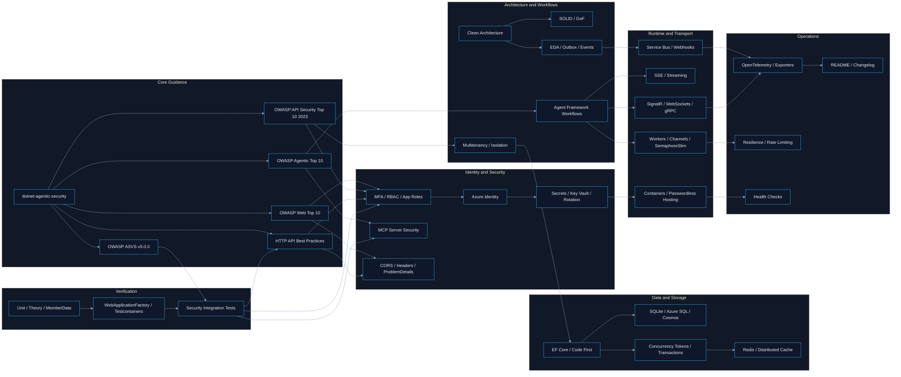

# Topic Relationship Map

Use this file when the user wants a conceptual map of how the `.NET` security, architecture, and operational topics relate.

## Reading hints

- security topics reinforce both API and agentic guidance
- architecture topics shape how security and testing are applied
- runtime topics describe transport and orchestration surfaces
- operations and testing prove the system works safely in practice
- OWASP API Security Top 10 2023 and OWASP ASVS v5.0.0 should drive concrete implementation checks, not just awareness
